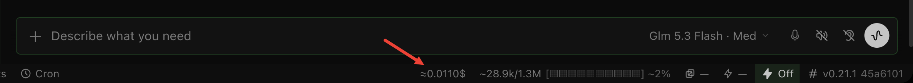

# hermes-session-cost

A tiny [Hermes Agent](https://hermes-agent.nousresearch.com) desktop plugin that shows the
**estimated LLM cost of the focused conversation** in the status bar.



No API key, no backend — the cost is read straight from Hermes' own session
accounting (`estimated_cost_usd` / `actual_cost_usd` on the session row), priced
from the model catalog. Works with any provider, not just OpenRouter.

## Install

> **Note:** the plugin is not yet in the Hermes plugin catalog —
> `hermes plugins install hermes-session-cost` will not work until the
> catalog PR is merged. Use one of the two methods below in the meantime.

**Paste this to your Agent:**

```
Install the Hermes desktop plugin from https://github.com/404BugX/hermes-session-cost —
put plugin.js in ~/.hermes/desktop-plugins/session-cost/ and reload desktop plugins.
```

**Manual:**

```bash
mkdir -p ~/.hermes/desktop-plugins/session-cost
curl -o ~/.hermes/desktop-plugins/session-cost/plugin.js \
  https://raw.githubusercontent.com/404BugX/hermes-session-cost/main/plugin.js
```

The desktop app hot-reloads the file within seconds.

## Settings

Open the command palette (⌘K) and look for:

- **Session Cost: decimals** — cycle 2 / 3 / 4 / 5 decimals
- **Session Cost: dollar sign position** — `$0.0521` (prefix) or `0.0521$` (suffix)

Settings persist across restarts.

## How it works

Hermes' backend already books a per-session cost (estimated from the model's
pricing, or actual when the provider reports one). This plugin polls the session
list every 8 s, matches the focused session, and displays the value. It follows
you between chat tiles.

- One file, no build step, plain ESM
- Follows the focused session (tile-aware)
- Zero provider API calls, zero secrets

## License

MIT

---

Made by [404BugX](https://github.com/404BugX) and his Agent.
